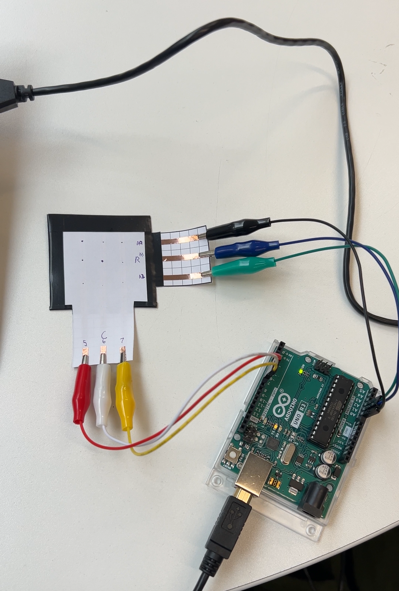
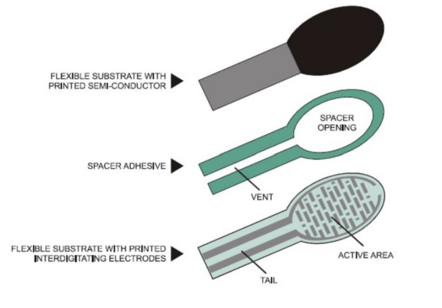

# Tactile Array Sensor (Pressure Matrix) for Myoelectric A Prosthetic Hand
For my undergraduate project at Queen Mary University, I am working in a group to create an affordable myoelectric prosthetic hand for a trans-radial amputee. Many of the options currently available on the market are extremely expensive. We aim to create an alternative that is not only less expensive but gives users a sense of touch. This tactile sensor is made cheaply and can be easily replaced if issues arise.

Figure 1. Picture of the full system which includes the sensor and Arduino used.

#Initial experiments
Before discovering the pressure matrix, I initially tried using an FSR. Force sensor resistors (FSR) are commonly used in tactile sensing in a variety of forms. FSRs are a polymer thick film (PTF) device that record decreases in resistance when a force is applied to its active surface, see Figure 3. These sensors can be either square or circular, for my application I used a small, circular one. They are cheap and quite robust but can only be used on flat surfaces. Applying them to a curved surface may cause pre-loading that will need to be measured and accounted for. Similar to a pressure sensor, they can only sense how much force they have received and not where. A further disadvantage is that they can only sense changes in force in a one dimensional space. Not at an angle and only from one surface.

 

#Constructing the pressure matrix

Following an online tutorial [1], I constructed my original prototype of the sensor out of copper tape, Velostat, and paper. In Arduino, the code provided allowed the Arduino to receive 9 sensor values and print them in a line before repeating. This solution worked quite well but was difficult to integrate with the haptic system due to the values being in a loop and difficult to call.

#References
1. HOW TO GET WHAT YOU WANT [Internet]. Available from: https://www.kobakant.at/DIY/?p=7443
